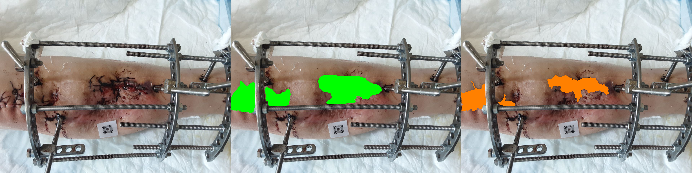
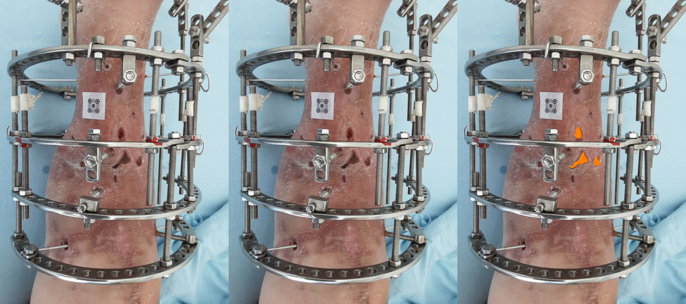

# Project Progress Report: Postoperative Wound Detection and Segmentation

## 1. Executive Summary

This project builds a two-stage wound detection and segmentation pipeline from postoperative clinical photographs. A scattered CVAT export (531 raw images, 241 tasks) was cleaned into a standardized wound-only dataset of 380 images (369 with wound annotations, 532 total annotations). Experiments progressed from a Mask R-CNN baseline to a YOLO11m-seg + U-Net++ hybrid pipeline with systematic optimization.

**Key results (test set, April 2026):**

| Pipeline | bbox AP50 | bbox AP75 | segm AP50 | segm AP75 | Dice | IoU |
|------|------:|------:|------:|------:|------:|------:|
| Mask R-CNN baseline | 0.3981 | 0.0625 | 0.2170 | 0.0076 | — | — |
| YOLO11m-seg standalone | **0.8169** | — | **0.6620** | — | — | — |
| U-Net++ ROI (test) | — | — | — | — | 0.7837 | 0.6606 |
| Combined (before tuning) | 0.5981 | 0.0124 | 0.5794 | 0.0422 | 0.7076 | 0.5780 |
| **Combined (final tuned)** | **0.7502** | **0.5223** | **0.5611** | **0.0991** | **0.6695** | **0.5491** |

The optimization cycle improved `bbox_AP75` by 42x (0.0124 → 0.5223). Error analysis identifies `shifted_roi_or_mask` as the dominant remaining failure mode.

## 2. Dataset

### 2.1 Raw to Clean Pipeline

| Stage | Count |
|------|------:|
| Raw images processed | 531 |
| Valid standardized images | 380 |
| Ambiguous (excluded) | 150 |
| Images with wound annotations | 369 |
| Total wound annotations | 532 |
| Infected / Non-infected | 158 / 222 |

### 2.2 Splits

| Split | Total images | Wound-only images |
|------|------:|------:|
| Train | 266 | 257 |
| Validation | 57 | 57 |
| Test | 57 | 55 |

Filename convention: `task_{id:03d}_img_{global:06d}_{infection_label}.jpg`
Infection labels inferred from naming heuristic (`-not-` → not_infected).
Offline 4x augmentation expands training to ~1028 images.

## 3. Architecture

**Stage 1 — YOLO11m-seg:** Full-image wound detection and coarse segmentation.
**Stage 2 — U-Net++:** ROI-based mask refinement on YOLO-proposed crops.
**Combined inference:** YOLO proposals → padded ROI crop → U-Net++ refinement → mask upscale → morphological postprocessing.

## 4. Training Configuration

| Parameter | YOLO11m-seg | U-Net++ |
|-----------|-------------|---------|
| Input size | 768 | 384 × 384 |
| Encoder | — | EfficientNet-B1 (ImageNet) |
| Batch size | 4 | 8 |
| Epochs | 60 | 50 |
| Optimizer | SGD (lr=0.01) | AdamW (lr=1e-4) |
| Scheduler | — | CosineAnnealingLR (T_max=45) |
| Loss | default | focal-dice (α=0.25, γ=2.0) |
| ROI padding | — | 0.12 |
| Training time | ~67 min | ~28 min |

**Combined inference config:**

| Parameter | Value |
|-----------|-------|
| yolo_conf_thresh | 0.20 |
| unet_mask_thresh | 0.35 |
| roi_padding | 0.12 |
| postprocess_preset | close_fill |
| coco_bbox_mode | mask_tight |
| enable_tta | false |

## 5. Results

### 5.1 Mask R-CNN Baseline (ResNet-50-FPN, 512×512, 50 epochs)

| Metric | Test |
|------|------:|
| bbox_AP50 | 0.3981 |
| bbox_AP75 | 0.0625 |
| segm_AP50 | 0.2170 |
| segm_AP75 | 0.0076 |
| Training time | ~53 min |

### 5.2 YOLO11m-seg Standalone

| Metric | Validation | Test |
|------|------:|------:|
| bbox mAP50 | 0.8591 | 0.8169 |
| bbox mAP50-95 | 0.5163 | 0.5387 |
| segm mAP50 | 0.7183 | 0.6620 |
| segm mAP50-95 | 0.2601 | 0.2503 |
| combined AP50 | — | 0.7395 |

### 5.3 U-Net++ ROI Refinement

| Metric | Value |
|------|------:|
| Best val Dice | 0.7758 (epoch 19) |
| Test Dice | 0.7837 |
| Test IoU | 0.6606 |
| Test pixel accuracy | 0.8879 |

### 5.4 Combined Pipeline — Before vs After Optimization

| Metric | Before | After | Change |
|------|------:|------:|------|
| coco_bbox_AP50 | 0.5981 | **0.7502** | +25% |
| coco_bbox_AP75 | 0.0124 | **0.5223** | **×42** |
| coco_segm_AP50 | 0.5794 | **0.5611** | −3% |
| coco_segm_AP75 | 0.0422 | **0.0991** | ×2.3 |
| coco_combined_AP50 | 0.5888 | **0.6556** | +11% |
| mean_dice | 0.7076 | **0.6695** | * |
| mean_iou | 0.5780 | **0.5491** | * |
| Images missed | 4 | **1** | −75% |

\* Dice/IoU decreased because missed images are now correctly counted (54/55 vs 51/55).

**Key fixes that drove improvement:**
1. ROI padding aligned (0.12 train = 0.12 inference)
2. `mask_tight` bbox mode instead of `padded_roi`
3. `close_fill` morphological postprocessing
4. Systematic threshold grid search

## 6. Error Analysis (Test Split)

| Error category | Count |
|------|------:|
| ok_or_minor | 27 |
| shifted_roi_or_mask | 18 |
| over_segmentation | 9 |
| fragmented_mask | 8 |
| poor_bbox_localization | 8 |
| boundary_or_alignment_error | 6 |
| missed_detection | 3 |
| moderate_bbox_iou | 2 |

Primary bottleneck: `shifted_roi_or_mask` (33% of test images).

## 7. Current Limitations

1. `segm_AP75 = 0.0991` remains weak (bbox_AP75 is 0.5223).
2. Infection classifier not re-evaluated on a named split.
3. Marker-based area estimation uses static `pixels_per_cm = 26.0`; dynamic calibration requires retraining with wound+marker classes.
4. Segmentation experiment groups B–G not yet executed.

## 8. Next Steps

1. Run segmentation experiment groups B–G (YOLO-like crops, higher resolution, boundary loss, DeepLabV3+).
2. Freeze final thesis pipeline.
3. Re-train infection classifier with explicit split evaluation.
4. If marker-based area is in scope, retrain with `classes: ["wound", "marker"]`.

## 9. Figures

### 9.1 Combined training curves — YOLO + U-Net++

**Figure 1 — Training overview (4-panel).**

### 9.2 YOLO11m-seg detailed metrics

**Figure 2 — YOLO precision, recall, losses, mAP over epochs.**

**Figure 3 — YOLO normalized confusion matrix.**

### 9.3 U-Net++ ROI refinement

**Figure 4 — U-Net++ loss, Dice, IoU over epochs.**

### 9.4 Optimization comparison

**Figure 5 — Combined pipeline: before vs after optimization.**

### 9.5 Mask R-CNN baseline curves

**Figure 6 — Mask R-CNN: training loss.**

**Figure 7 — Mask R-CNN: AP curves.**

### 9.6 Qualitative predictions — YOLO

**Figure 8 — YOLO predictions (infected).**

**Figure 9 — YOLO predictions (not infected).**

### 9.7 Qualitative predictions — Combined pipeline

**Figure 10 — Combined prediction (infected).**

**Figure 11 — Combined prediction (not infected).**

### 9.8 Error analysis samples

**Figure 12 — Error: shifted ROI or mask.**

**Figure 13 — Error: over-segmentation.**

**Figure 14 — Error: fragmented mask.**

**Figure 15 — Error: missed detection.**

