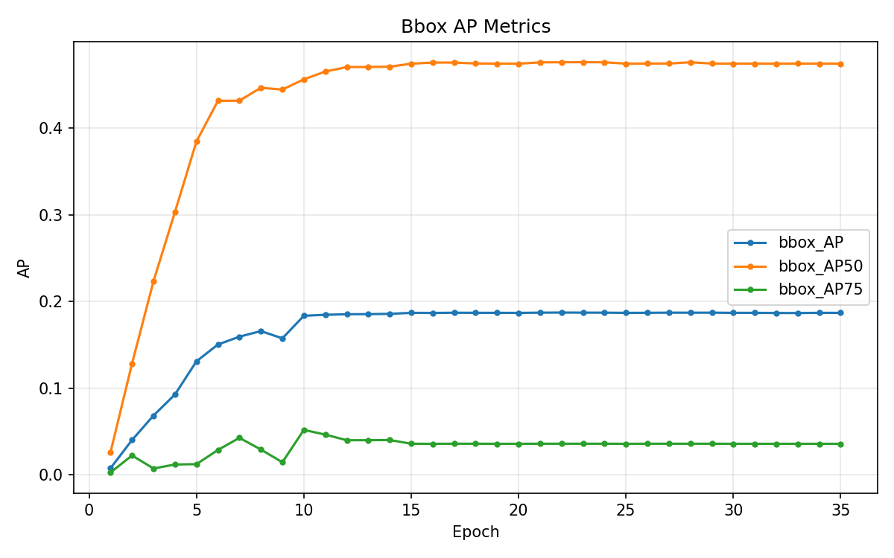
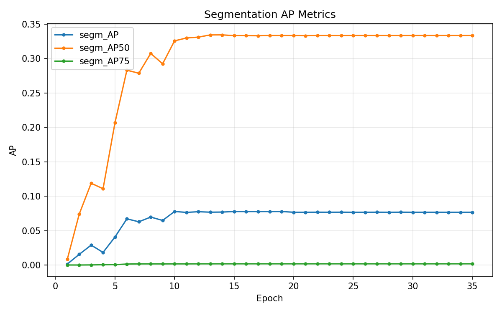
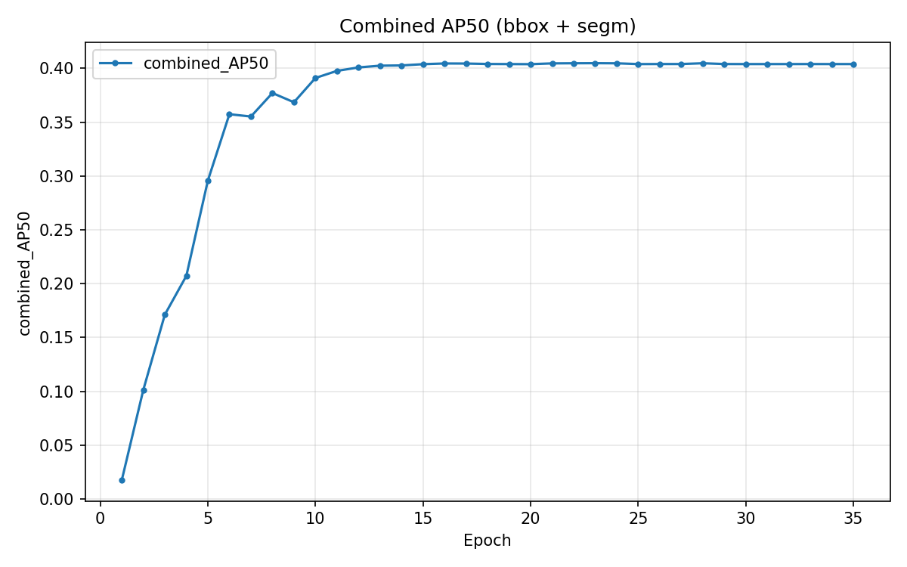
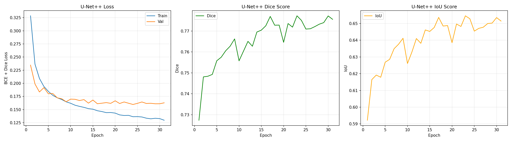
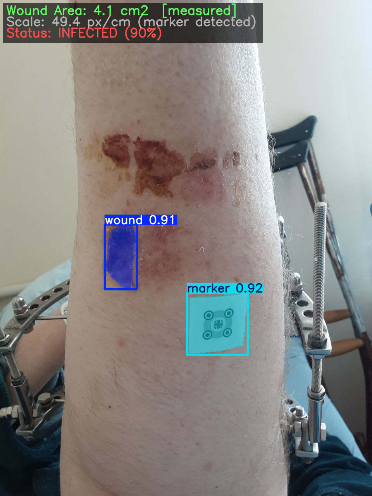

# Project Progress Report: Postoperative Wound Detection and Segmentation Pipeline Development

## Executive Summary

This report documents the progress of the postoperative wound analysis project from raw dataset organization through dataset standardization, wound-only dataset construction, baseline model development, hybrid pipeline design, and later optimization. The repository evidence shows that the project evolved from a broader multi-class medical image segmentation goal into a more realistic wound-focused pipeline centered on wound localization, wound segmentation, and infection-related analysis where the available data supports it.

The dataset preparation stage was a major part of the work. The raw CVAT export was not directly suitable for reproducible training because file naming was inconsistent, infection status had to be inferred from manifest metadata, and many images had ambiguous naming patterns. A two-stage data pipeline was therefore established. First, the raw images were standardized into a curated wound-focused dataset with deterministic file naming and traceability. Second, the dataset was filtered into a wound-only segmentation dataset with reproducible train, validation, and test splits. This produced a cleaned working set of 380 standardized images, of which 369 contain wound annotations and 532 wound annotations in total.

Experimentally, the project progressed from a wound-only Mask R-CNN baseline to a more advanced YOLO11m-seg and U-Net++ hybrid pipeline. The saved metrics indicate that the standalone YOLO11m-seg experiment currently provides the strongest AP-based wound detection and segmentation performance among the available saved runs, while the tuned combined pipeline represents the most mature integrated system in architectural terms. However, the combined pipeline still shows a clear weakness in high-overlap boundary precision, particularly at `segm_AP75`, and should therefore be considered a strong research-stage candidate rather than a final settled solution.

## 1. Introduction

This project is part of a Master's thesis focused on wound analysis from postoperative clinical photographs using deep learning. The original technical ambition included wound detection, wound segmentation, marker-based wound area estimation, and fine-grained segmentation of clinically relevant wound-related structures such as edema, hyperemia, necrosis, granulation, and fibrin. The current repository evidence shows that the practical scope was later refined.

The present direction is more focused and technically supported by the available data: wound localization, wound-region segmentation, and infection-related analysis where possible. This refinement reflects the actual quality and consistency of the available annotations. The project remains research-oriented and is not suitable for clinical deployment.

## 2. Project Objective

The project objective is to build a reproducible computer-vision pipeline for postoperative wound image analysis. The main technical goals are:

1. Detect the wound region in clinical photographs.
2. Segment the wound area with sufficient quality for later measurement and analysis.
3. Use the 3 x 3 cm reference marker for wound-area calibration where available.
4. Support infected versus non-infected analysis using the available naming and manifest convention.
5. Build an experiment pipeline that produces reproducible datasets, metrics, visual outputs, and reports.

## 3. Problem Definition

The project is not only a model-training problem. It is also a dataset engineering problem. The raw image collection was distributed across many CVAT task folders, and the project required:

1. Consolidating data into a consistent structure.
2. Recovering usable infection labels from naming conventions.
3. Filtering data into a tractable segmentation target.
4. Producing reproducible train, validation, and test splits.
5. Running experiments that can be compared fairly.

A major conclusion reached during the project is that the available dataset is more suitable for wound-region analysis than for dependable fine-grained multi-class pathology segmentation. This shaped the later experimental direction.

## 4. Dataset Description

### 4.1 Raw Dataset Source and Structure

The project documentation describes the raw dataset as a CVAT export under `data/original_data/`, organized as approximately 241 task folders from `task_0` to `task_240`. Each task contains image files in a `data/` directory as well as task-specific metadata such as `annotations.json`, `task.json`, and manifest information.

The standard project interpretation is:

| Item | Value |
|------|------:|
| Raw task folders scanned | 241 |
| Raw images processed in the standardization stage | 531 |
| Raw format | CVAT task export |
| Later working annotation format | COCO-style JSON |

### 4.2 Raw Label Set

The documented label set includes wound-related classes such as:

- Entire wound
- Size marker
- Edema zone
- Hyperemia zone
- Necrosis zone
- Granulation zone
- Fibrin
- Purulent discharge
- Suture zone

The wound class is consistently treated as the primary segmentation target in the later cleaned pipeline.

### 4.3 Why the Raw Dataset Was Not Directly Usable

The raw dataset was not directly ready for training for several reasons:

1. Image naming was inconsistent across task folders.
2. Infection status had to be inferred from manifest naming patterns rather than from a dedicated label file.
3. A substantial subset of images had ambiguous infection status and therefore could not be safely used in the standardized valid subset.
4. Annotation quality for secondary subclasses was judged insufficient for dependable fine-grained segmentation.
5. The repository supports wound-only dataset construction, but it does not include a dedicated cleaning log proving every upstream polygon-fixing or bbox-recomputation step in detail.

## 5. Dataset Cleaning and Preparation

### 5.1 Stage 1: Standardization and Traceable Renaming

The first data-cleaning stage produced `data/wound_focus_clean/`. This stage did not modify the raw dataset in place. Instead, it created a standardized wound-focused dataset with copied images, mapping files, ambiguity reports, and infection labels where status could be inferred with confidence.

The main outputs of Stage 1 were:

- `images/`
- `mappings/image_mapping.csv`
- `mappings/image_mapping.json`
- `mappings/skipped_images.csv`
- `mappings/ambiguous_cases.csv`
- `reports/RENAMING_REPORT.md`

The standardized filename convention is:

`task_{task_id:03d}_img_{global_id:06d}_{infection_label}.jpg`

This design improves traceability and reproducibility.

### 5.2 Infection Label Inference

Infection status was inferred using a documented naming heuristic:

- filenames containing `-not-` were treated as `not_infected`
- filenames with clinical patterns and no `-not-` were treated as `infected`
- ambiguous names were excluded from the valid standardized subset

This was a practical and necessary step, but it also means that infection labeling is convention-based rather than independently clinically verified.

### 5.3 Stage 1 Statistics

| Item | Count |
|------|------:|
| Total processed raw images | 531 |
| Valid standardized images | 380 |
| Ambiguous cases | 150 |
| Skipped cases | 1 |
| Tasks with at least one valid image | 139 |
| Tasks with multiple valid images | 89 |

### 5.4 Stage 2: Wound-Only Dataset Construction

The second data-building stage used the standardized image set and the cleaned COCO annotations to build a wound-only segmentation dataset. In this stage, the whole wound class was retained and the other documented wound-related structures were removed from the wound-only segmentation target.

The reported filtering logic was:

- kept: whole wound
- removed from wound-only segmentation target: marker, edema, hyperemia, necrosis, granulation, fibrin, purulent discharge, and suture-related structure

### 5.5 Stage 2 Statistics

| Item | Count |
|------|------:|
| Total standardized images | 380 |
| Images with wound annotations | 369 |
| Images without wound annotations | 11 |
| Total wound annotations | 532 |
| Infected images | 158 |
| Non-infected images | 222 |
| Train images | 266 |
| Validation images | 57 |
| Test images | 57 |
| Train wound-only images | 257 |
| Validation wound-only images | 57 |
| Test wound-only images | 55 |

### 5.6 Final Cleaned Dataset Structure

The final cleaned working dataset contains:

- standardized wound image files
- original-to-standardized mapping files
- wound-only COCO annotation files
- infection label files
- split text files and split COCO JSON files
- validation and build reports

This is a major milestone because it converts a scattered raw dataset into a reproducible experimental asset.

### 5.7 What Is Confirmed and What Is Not

The repository clearly confirms renaming, filtering, wound-only remapping, deterministic splitting, and dataset validation. However, some cleaning operations mentioned conceptually in the project scope are not backed by a dedicated cleaning log in the reviewed files. Therefore, the report does not claim as confirmed historical fact that polygon clipping, polygon simplification, or bbox and area recomputation were fully documented step by step. Those operations may exist upstream in `annotations_cleaned.json`, but the available snapshot does not prove them in detail.

## 6. Preprocessing and Augmentation

The project uses both preprocessing and augmentation strategies.

For the wound-only Mask R-CNN pipeline, the saved configuration shows:

| Setting | Value |
|---------|-------|
| Image size | 512 x 512 |
| Batch size | 2 |
| Epochs | 50 |
| Learning rate | 0.001 |
| Medical augmentation | enabled |
| Augmentation intensity | moderate |
| Marker preservation | enabled |

The repository also contains a broader augmentation guide and an offline augmented tree under `data/wound_focus_clean/augmented/`, indicating that augmentation was considered part of the overall data strategy.

For the YOLO11m-seg and U-Net++ pipeline, the saved combined configuration indicates:

| Component | Main settings |
|-----------|---------------|
| YOLO11m-seg | image size 1024, batch size 4, epochs 100, SGD optimizer |
| U-Net++ | input size 256 x 256, batch size 16, epochs 35, AdamW, CosineAnnealingLR |
| Combined inference | threshold tuning, ROI padding 0.1, TTA enabled |

The project documentation explicitly avoids medically unrealistic geometry distortions, especially where marker geometry could affect area calibration.

## 7. Experimental Development Stages

### 7.1 Scope Refinement After Dataset Review

A major turning point was the decision to reduce emphasis on fine-grained multi-class pathology segmentation. The repository documentation states that annotation quality was insufficient for dependable detailed subclass segmentation. This redirected the project toward wound-only segmentation and infection-related analysis.

### 7.2 Baseline Wound-Only Segmentation With Mask R-CNN

The first strong reproducible experiment in the repository is a wound-only Mask R-CNN setup using a ResNet-50-FPN backbone. This established a clear baseline and validated that the dataset and training pipeline could run end to end.

### 7.3 Development of a Hybrid Pipeline

The next major stage introduced a more advanced architecture:

- YOLO11m-seg for full-image wound detection
- U-Net++ for ROI-based wound-mask refinement
- combined inference logic
- marker calibration logic in the architecture
- infection classifier components

This stage represents the most ambitious systems-level design in the project.

### 7.4 Tuning and Optimization Stage

A later optimization phase audited the hybrid pipeline, identified critical bottlenecks, corrected configuration mismatches, and ran staged tuning. This is the most mature evidence-backed performance improvement stage in the repository.

## 8. Results of Each Experiment

### 8.1 Experiment 1: Mask R-CNN Wound-Only Baseline

**Purpose**  
To establish a reproducible wound-only segmentation baseline using a standard instance-segmentation architecture.

**Architecture**  
Mask R-CNN with ResNet-50-FPN, `num_classes = 2` including background and wound.

**Dataset Used**  
`wound_focus_clean` wound-only splits.

**Training Settings**  
512 x 512 input, batch size 2, 50 epochs, learning rate 0.001, medical augmentation enabled.

**Best Validation Metrics**

| Metric | Value |
|------|------:|
| Best epoch | 13 |
| combined_AP50 | 0.4171 |
| bbox_AP50 | 0.5171 |
| segm_AP50 | 0.3170 |

**Test Metrics**

| Metric | Value |
|------|------:|
| bbox_AP | 0.1521 |
| bbox_AP50 | 0.3981 |
| bbox_AP75 | 0.0625 |
| segm_AP | 0.0575 |
| segm_AP50 | 0.2170 |
| segm_AP75 | 0.0076 |
| combined_AP50 | 0.3076 |

**Training Time**  
3206.89 seconds, approximately 53.4 minutes.

**Interpretation**  
This baseline proved that the wound-only dataset and training setup were operational and that the model could learn a meaningful wound signal. However, the low test segmentation metrics, especially `segm_AP75 = 0.0076`, show that precise boundary quality remained poor. The baseline is therefore useful as a reference point rather than a final model.

### 8.2 Experiment 2: YOLO11m-seg Standalone Model

**Purpose**  
To improve wound localization and segmentation performance using a higher-resolution segmentation detector.

**Architecture**  
YOLO11m-seg.

**Dataset Used**  
`wound_focus_clean`; the experiment folder also documents conversion to YOLO segmentation format and optional offline augmentation.

**Training Settings**  
1024 input size, batch size 4, 100 epochs, SGD optimizer, tuned medical augmentation parameters.

**Test Metrics**

| Metric | Value |
|------|------:|
| bbox_mAP50 | 0.7858 |
| bbox_mAP50_95 | 0.4726 |
| segm_mAP50 | 0.6772 |
| segm_mAP50_95 | 0.2365 |
| combined_AP50 | 0.7315 |

**Interpretation**  
Among the saved standalone model results, YOLO11m-seg currently shows the strongest AP-based wound detection and segmentation performance. It is substantially stronger than the Mask R-CNN baseline on the available test metrics and is the strongest saved single-model candidate in the repository snapshot.

### 8.3 Experiment 3: U-Net++ ROI Refinement Model

**Purpose**  
To refine wound segmentation boundaries on cropped wound ROIs rather than on full images.

**Architecture**  
U-Net++ with EfficientNet-B1 encoder.

**Dataset Used**  
ROI crops generated from wound annotations.

**Training Settings**  
256 x 256 input size, batch size 16, 35 epochs, AdamW optimizer, CosineAnnealingLR, focal-dice loss, ROI padding 0.1.

**Reported Metrics**

| Metric | Value |
|------|------:|
| Best validation Dice | 0.7743 |
| Best epoch | 17 |
| Test Dice | 0.7796 |
| Test IoU | 0.6535 |
| Test pixel accuracy | 0.8819 |
| Test samples | 74 |
| Training time | 882.85 seconds |

**Interpretation**  
The U-Net++ stage performs well on ROI-level mask quality metrics and demonstrates that wound boundaries can be modeled much more effectively in a focused crop setting than in a harder full-image setting. These metrics are not directly comparable to full-image COCO AP from the detection pipelines.

### 8.4 Experiment 4: Combined YOLO11m-seg + U-Net++ Pipeline, Final Tuned Configuration

**Purpose**  
To combine strong full-image localization from YOLO with localized mask refinement from U-Net++.

**Architecture**  
YOLO11m-seg for wound proposals plus U-Net++ ROI refinement, combined with thresholding, ROI padding, and test-time augmentation.

**Reported Final Test Metrics**

| Metric | Value |
|------|------:|
| coco_bbox_AP | 0.4301 |
| coco_bbox_AP50 | 0.7333 |
| coco_bbox_AP75 | 0.4567 |
| coco_segm_AP | 0.1744 |
| coco_segm_AP50 | 0.5279 |
| coco_segm_AP75 | 0.0578 |
| coco_combined_AP50 | 0.6306 |
| mean_dice | 0.6494 |
| mean_iou | 0.5271 |
| mean_dice_conditional | 0.6868 |
| mean_iou_conditional | 0.5575 |
| Images total / evaluated / missed | 55 / 52 / 3 |

**Interpretation**  
This is the most developed integrated pipeline in the project. It has much better bbox precision than the Mask R-CNN baseline and clearly benefits from systematic tuning. However, it still underperforms the saved standalone YOLO model on `segm_AP50`, and its `segm_AP75` remains low. This shows that the pipeline is functionally mature but still limited in precise boundary reconstruction.

### 8.5 Experiment 5: Combined Pipeline Before Optimization

**Purpose**  
To document the performance level before systematic tuning and fixes.

**Reported Test Metrics**

| Metric | Value |
|------|------:|
| coco_bbox_AP50 | 0.5981 |
| coco_bbox_AP75 | 0.0124 |
| coco_segm_AP50 | 0.5794 |
| coco_segm_AP75 | 0.0422 |
| coco_combined_AP50 | 0.5888 |
| mean_dice | 0.7076 |
| mean_iou | 0.5780 |

**Interpretation**  
These values provide the baseline for the later hybrid optimization report. They must be interpreted carefully because later project documentation explains that older Dice values were inflated by excluding missed images. The optimization stage therefore improved both evaluation correctness and performance understanding.

### 8.6 Experiment 6: Infection Classifier

**Purpose**  
To model infected versus non-infected status using wound-related features.

**Reported Metrics**

| Metric | Value |
|------|------:|
| accuracy | 0.7267 |
| precision | 0.6387 |
| recall | 0.7734 |
| f1_score | 0.6996 |
| n_samples | 311 |

**Interpretation**  
The infection classifier is present and produces usable metrics, but the saved metrics file does not state whether these values correspond to train, validation, or test. The result is therefore promising but not yet strong enough to present as a final validated evaluation.

## 9. Comparative Analysis of Experiments

### 9.1 Comparison by Main Metric Family

| Experiment | Primary evaluation style | Main outcome |
|------|------|------|
| Mask R-CNN wound-only | COCO bbox and segm AP | workable baseline, weak high-IoU segmentation |
| YOLO11m-seg | full-image AP metrics | strongest saved standalone AP-based performance |
| U-Net++ ROI | Dice, IoU, pixel accuracy | strongest local ROI mask quality |
| Combined final | COCO AP plus Dice and IoU | most mature pipeline, but high-IoU mask precision remains weak |
| Infection classifier | classification metrics | moderate result, but evaluation split is unspecified |

### 9.2 Direct Numeric Comparison

| Model or pipeline | bbox AP50 or mAP50 | bbox AP75 | segm AP50 or mAP50 | segm AP75 | Dice | IoU |
|------|------:|------:|------:|------:|------:|------:|
| Mask R-CNN | 0.3981 | 0.0625 | 0.2170 | 0.0076 | not primary metric | not primary metric |
| YOLO11m-seg | 0.7858 | not separately reported in saved test JSON | 0.6772 | not separately reported | not primary metric | not primary metric |
| U-Net++ ROI | not applicable | not applicable | not applicable | not applicable | 0.7796 | 0.6535 |
| Combined final | 0.7333 | 0.4567 | 0.5279 | 0.0578 | 0.6494 full / 0.6868 conditional | 0.5271 full / 0.5575 conditional |

### 9.3 What Improved Over Time

The strongest performance evolution appears to come from three sources:

1. dataset simplification from broad label ambitions to wound-only segmentation
2. stronger detection architecture in YOLO11m-seg
3. systematic tuning of the combined pipeline, especially around padding, thresholds, and evaluation correctness

## 10. Improvement Journey

The project improvement journey is technically coherent.

The earliest major bottleneck was not only model quality but target definition. The project began with a broad medical annotation space, but the annotation review showed that detailed subclass segmentation could not be treated as a dependable primary thesis result with the current dataset. This led to the first major improvement: narrowing the target to wound-only segmentation.

The second improvement stage was dataset engineering. Standardized naming, ambiguity filtering, traceable mappings, and reproducible splits transformed the data into a manageable training asset. This was a necessary precondition for meaningful experiments.

The third stage was baseline establishment with Mask R-CNN. That baseline was important because it proved the wound-only pipeline could train, validate, and produce interpretable outputs. However, its metrics showed that stronger architectures were needed.

The fourth stage introduced a higher-capacity pipeline using YOLO11m-seg and U-Net++. This was a deliberate architectural attempt to separate global localization from local boundary refinement.

The fifth stage was systematic optimization. The hybrid optimization report identified major issues such as test evaluation using an old configuration, ROI padding mismatch between training and inference, and high-IoU segmentation as the real bottleneck. This stage materially improved the credibility of the project because it did not merely report better numbers; it also corrected the evaluation logic and clarified the remaining weakness.

## 11. Current Best Model and Its Status

The answer depends on the evaluation criterion.

If the criterion is the best saved standalone detection and segmentation performance on the test set, the current best model is **YOLO11m-seg**, with:

- `bbox_mAP50 = 0.7858`
- `segm_mAP50 = 0.6772`
- `combined_AP50 = 0.7315`

If the criterion is the most developed integrated project pipeline, the current best candidate is the **final tuned YOLO11m-seg + U-Net++ combined pipeline**, because it includes the intended multi-stage workflow, systematic optimization, corrected evaluation logic, and both COCO and pixel-level outputs. Its key strengths are:

- `coco_bbox_AP50 = 0.7333`
- `coco_bbox_AP75 = 0.4567`
- `coco_combined_AP50 = 0.6306`
- documented optimization process and error analysis

However, the same repository evidence shows that the combined pipeline still underperforms YOLO-only on saved `segm_AP50`, and its `segm_AP75 = 0.0578` remains weak. For that reason, the combined pipeline should be described as the **best current integrated research candidate**, not yet a final settled model.

## 12. Current Limitations

The current project limitations are clear and important:

1. The dataset does not currently support strong claims for fine-grained subclass segmentation.
2. The provenance of all upstream annotation-cleaning operations is not fully documented in a dedicated log.
3. The documented improved Mask R-CNN preset exists in code, but no saved improved-run artifacts were found in the reviewed repository snapshot.
4. The combined pipeline still has weak boundary precision at high IoU, especially `segm_AP75`.
5. The infection classifier metrics file does not specify whether the saved metrics correspond to train, validation, or test.
6. Marker-based wound area estimation is part of the intended architecture, but the current saved evidence is still centered primarily on wound segmentation rather than a finalized area-estimation evaluation package.
7. Some markdown reports are internally inconsistent with saved JSON metrics, so JSON outputs must be treated as the more reliable metric source.

## 13. Recommended Next Steps Before Thesis Writing or Final Adoption

The next practical steps should be:

1. Freeze one primary thesis pipeline and state explicitly whether the final thesis model is YOLO-only or the tuned combined pipeline.
2. Re-run and archive one final locked evaluation package with consistent documentation across JSON, plots, and markdown reports.
3. Add a final explicit evaluation statement for the infection classifier on a named split.
4. If marker-based area estimation is part of the final thesis contribution, produce a separate validated quantitative evaluation for area calculation.
5. Include qualitative examples of strong predictions and failure cases in the supervisor-facing report.
6. Avoid positioning fine-grained multi-class pathology segmentation as a completed result unless the dataset is further relabeled or cleaned.
7. Use this progress report as the basis for the later thesis methodology and experiments chapters.

## 14. Conclusion

The project has progressed well beyond the exploratory stage. The most important achievements are not limited to model training. They include converting a difficult raw CVAT export into a standardized wound-focused dataset, redefining the project scope in response to annotation reality, establishing a reproducible wound-only baseline, building a stronger hybrid architecture, and carrying out a genuine optimization cycle with documented technical findings.

At the current stage, the project has a solid technical foundation for thesis writing. It also has a clear research narrative: the dataset required substantial preparation, the original multi-class ambition had to be narrowed for methodological honesty, stronger architectures improved performance, and the remaining bottleneck is now well understood. This is the appropriate basis for the next stage of thesis writing.

## 15. Summary of Completed Work

- reviewed and reinterpreted the dataset scope based on annotation quality
- built a standardized curated dataset from the raw CVAT export
- inferred infection status where naming evidence was sufficient and excluded ambiguous cases from the valid standardized subset
- created a wound-only segmentation dataset with reproducible splits
- validated the wound-only dataset and generated build reports
- trained and evaluated a Mask R-CNN wound-only baseline
- developed and evaluated a YOLO11m-seg experiment
- developed and evaluated a U-Net++ ROI refinement experiment
- built and optimized a combined YOLO11m-seg plus U-Net++ pipeline
- produced saved metrics, plots, and qualitative outputs for multiple stages

## 16. Summary of Remaining Work

- final selection of the thesis model or pipeline
- one locked final evaluation package
- explicit split-level validation for the infection classifier
- final area-estimation evaluation if marker-based measurement remains in scope
- final qualitative and failure-analysis figure set for thesis inclusion

## 17. Figures and Training Plots (embedded from repository outputs)

The images below are embedded from the experiment output folders so the Word report includes the actual training curves and diagnostic plots. Paths are relative to this document (`docs/`).

### 17.1 Mask R-CNN wound-only baseline

**Figure 1 — Mask R-CNN: training and validation loss.**

**Figure 2 — Mask R-CNN: bounding-box COCO AP vs epoch (validation).**

**Figure 3 — Mask R-CNN: segmentation COCO AP vs epoch (validation).**

**Figure 4 — Mask R-CNN: AP overview (validation).**

**Figure 5 — Mask R-CNN: combined AP50 vs epoch (validation).**

### 17.2 YOLO11m-seg

**Figure 6 — YOLO11m-seg: box precision–recall curve.**

**Figure 7 — YOLO11m-seg: mask precision–recall curve.**

**Figure 8 — YOLO11m-seg: box F1 vs confidence threshold.**

**Figure 9 — YOLO11m-seg: mask F1 vs confidence threshold.**

**Figure 10 — YOLO11m-seg: training summary strip (Ultralytics `results.png`).**

**Figure 11 — YOLO11m-seg: normalized confusion matrix.**

### 17.3 U-Net++ ROI refinement

**Figure 12 — U-Net++: training curves (ROI segmentation).**

### 17.4 Qualitative prediction samples

**Figure 13 — Mask R-CNN: example qualitative prediction.**

**Figure 14 — Mask R-CNN: example qualitative prediction.**

**Figure 15 — YOLO11m-seg: example prediction image.**

**Figure 16 — YOLO11m-seg: example prediction image.**

### 17.5 Additional figures to add manually (optional)

These are not stored as single standard plots in the repository snapshot; add screenshots or diagrams in Word if your supervisor expects them:

1. Raw dataset structure (example `task_N` folder with `data/` and JSON).
2. Dataset standardization pipeline diagram.
3. Example valid versus ambiguous filename cases from mapping reports.

### 17.6 Suggested Tables

1. Raw dataset versus cleaned dataset counts.
2. Final wound-only dataset split distribution.
3. Experiment configuration summary.
4. Per-experiment metric table.
5. Combined pipeline before-versus-after tuning comparison.
6. Current limitations and recommended next steps.

## 18. Evidence Notes and Reporting Cautions

This report is intentionally restricted to repository evidence and avoids unsupported claims. In particular:

1. the upstream provenance of every `annotations_cleaned.json` operation is not fully documented in a dedicated cleaning log
2. the documented improved Mask R-CNN preset has no saved run artifacts in the reviewed snapshot
3. the infection classifier metrics file does not specify train, validation, or test split
4. some markdown reports are less reliable than the saved JSON metrics and should not override them
